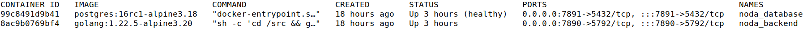
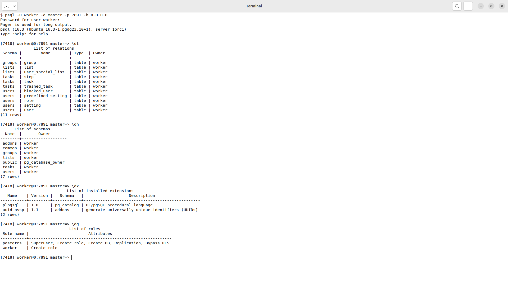
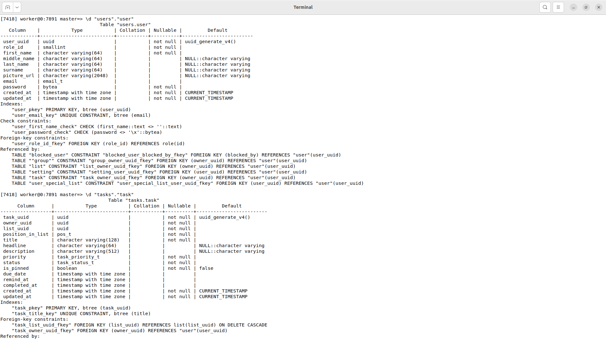
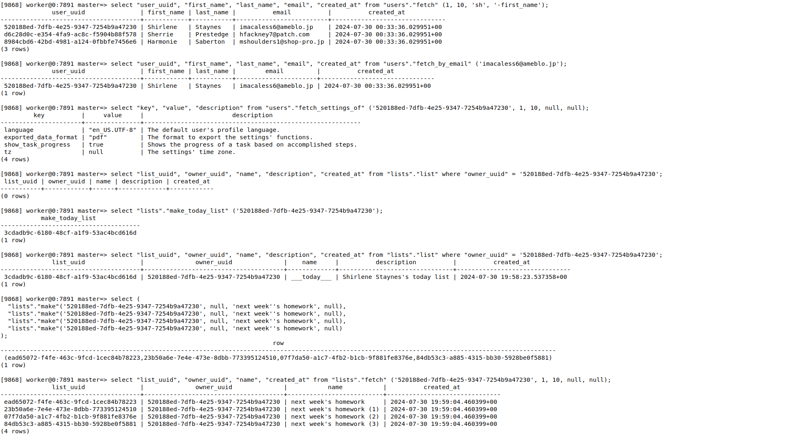
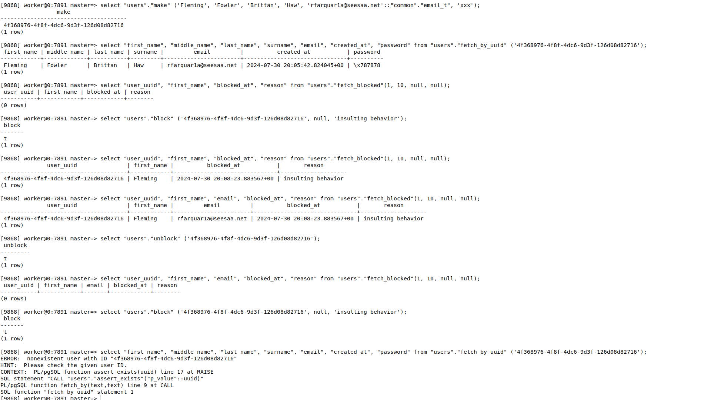

<div align="center">
  

---

  <a href="https://golang.org/doc/go1.20">
    
  </a>
  <a href="https://opensource.org/licenses/MIT">
    
  </a>
  
</div>

**NODA** is a RESTful task management web API built with Go and designed to simplify the process of managing tasks,
lists, and user interactions. It uses PostgreSQL for data storage, JSON Web Tokens (JWT) for authorization and security,
and Docker Compose for easy development.

## Table of contents

<!-- TOC -->
  * [Table of contents](#table-of-contents)
  * [Source code structure](#source-code-structure)
    * [Overall structure](#overall-structure)
    * [Detailed explanation](#detailed-explanation)
  * [Installation](#installation)
    * [Prerequisites](#prerequisites)
    * [Step-by-step setup](#step-by-step-setup)
  * [Running the tests](#running-the-tests)
  * [Screenshots](#screenshots)
    * [Database](#database)
      * [Some database objects](#some-database-objects)
      * [Some database tables](#some-database-tables)
      * [Searching for users and making lists for a specific user](#searching-for-users-and-making-lists-for-a-specific-user)
      * [Making and blocking a user with a reason](#making-and-blocking-a-user-with-a-reason)
  * [API endpoints](#api-endpoints)
    * [Authentication](#authentication)
    * [Users management](#users-management)
    * [Groups management](#groups-management)
    * [Lists management](#lists-management)
    * [Tasks management](#tasks-management)
    * [Steps management](#steps-management)
    * [Tags management](#tags-management)
    * [Attachments management](#attachments-management)
  * [Recommendations](#recommendations)
<!-- TOC -->

## Source code structure

For structuring the project source code I'm following a simple and pragmatic approach that has work very well for me.
Personally, I prefer to wire up everything in the [`main.go`](./main.go) file and avoid having separate files for
database configuration, server configuration and API routing, as I believe this is a more elegant and cleaner
approach compared to having several dispersed packages/files.

While I have a preference for wiring everything in [`main.go`](./main.go), it might be a wiser practice for very large
codebases to implement separation of concerns.

### Overall structure

```text
.
├── assets
├── client
├── data
│  ├── model
│  ├── transfer
│  └── types
├── database
├── docs
├── failure
├── global
├── handler
├── mocks
├── repository
└── service
```

> **NOTE:** Another approach would be to move the `model`, `transfer` and `types` directories (packages) to the root
> directory; this approach, however, provides the opportunity to refer these packages in a more natural way as in “data
> types”.

### Detailed explanation

* **assets**: Contains images and other similar assets.
* **client**: Contains the implementation of a client for this web API (not implemented yet.)
* **[data](./data)**
    * **[model](./data/model)**: Contains the data models representing the core entities of the application.
    * **[transfer](./data/transfer)**: Contains data transfer objects (DTOs) for communication with clients.
    * **[types](./data/types)**: Contains custom types used throughout the application.
* **[database](./database)**: Contains the database source code.
* **[docs](./docs)**: Holds detailed API documentation and usage (out of date).
* **[failure](./failure)**: Manages error handling and custom error definitions to standardize responses. (
  See [Recommendations](#recommendations).)
* **[global](./global)**: Contains globally accessible constants, especially if they're coming from environment
  variable.
* **[handler](./handler)**: Implements the HTTP request handlers.
* **[mocks](./mocks)**: Contains mock implementations for unit testing.
* **[repository](./repository)**: Defines the data access layer for interactions with the database.
* **[service](./service)**: Contains the business logic layer for core functionalities and validations.

I decided to move the database scripts to a different repository as I think this it's easier to maintain, version
control, scale and reuse. However, since I still need it, I make it accessible from this repository as a Git submodule.

## Installation

To run the project you require the database to be running. Once you've finished all the following steps, you must end up
having something like:



### Prerequisites

* Docker
* Docker Compose
* Git

### Step-by-step setup

1. Clone this repository and its submodules:

    ```shell
    git clone --recurse-submodules git@github.com:fontseca/noda-tasks-management-tool-api.git
    cd noda-tasks-management-tool-api
    ```

2. Run the Docker containers:

    ```shell
    docker compose up --detach
    ```

3. Bootstrap the database objects:

    ```shell
    docker exec --interactive --tty noda_database sh -c '$PROJECT_DIR/bootstrap.sh'
    ```

4. If the database objects are created successfully, then access the backend container and from there you can either
   build or run the web API server:

    ```shell
    docker exec --interactive --tty noda_backend sh
    cd /src
    go run .
    ```

Now you can start making requests to the web API at `http://0.0.0.0:7890`.

## Running the tests

You run the tests of at leas one of the packages `repository`, `service` and `handler` with the command:

````shell
go test ./repository/ ./service/ ./handler/
ok      noda/repository 0.051s
ok      noda/service    0.745s
ok      noda/handler    0.029s
````

Or, if you prefer using [gotestsum](https://github.com/gotestyourself/gotestsum):

````shell
gotestsum ./service/ ./repository ./handler
✓  handler (29ms)
✓  repository (48ms)
✓  service (643ms)

DONE 699 tests in 6.567s
````

## Screenshots

### Database

#### Some database objects



#### Some database tables



#### Searching for users and making lists for a specific user



#### Making and blocking a user with a reason



## API endpoints

### Authentication

| Actor | HTTP Method | Endpoint              | Description                                |
|-------|-------------|-----------------------|--------------------------------------------|
| Any   | `POST`      | `/signup`             | Create a new user.                         |
| User  | `POST`      | `/signin`             | Log in an existent user.                   |
| User  | `POST`      | `/me/logout`          | Log out the current user.                  |
| User  | `POST`      | `/me/change_password` | Change the password of the logged in user. |

### Users management

| Actor | HTTP Verb | Endpoint                 | Description                                           |
|-------|-----------|--------------------------|-------------------------------------------------------|
| Admin | `GET`     | `/users`                 | Retrieve all users.                                   |
| Admin | `GET`     | `/users/search`          | Search for users.                                     |
| Admin | `GET`     | `/users/{user_uuid}`       | Retrieve a user.                                      |
| Admin | `DELETE`  | `/users/{user_uuid}`       | Permanently remove a user and all its related data.   |
| Admin | `PUT`     | `/users/{user_uuid}/block` | Block one user.                                       |
| Admin | `DELETE`  | `/users/{user_uuid}/block` | Unblock one user.                                     |
| Admin | `GET`     | `/users/blocked`         | Retrieve all blocked users.                           |
| User  | `GET`     | `/me`                    | Get the logged in user.                               |
| User  | `PUT`     | `/me`                    | Partially update the account of the logged in user.   |
| User  | `DELETE`  | `/me`                    | Permanently remove the account of the logged in user. |
| User  | `GET`     | `/me/settings`           | Retrieve all the settings of the logged in user.      |

### Groups management

| Actor | HTTP Method | Endpoint                 | Description                                     |
|-------|-------------|--------------------------|-------------------------------------------------|
| User  | `GET`       | `/me/groups`             | Retrieve all the groups.                        |
| User  | `POST`      | `/me/groups`             | Create a new group.                             |
| User  | `GET`       | `/me/groups/{groups_id}` | Retrieve a group.                               |
| User  | `PATCH`     | `/me/groups/{groups_id}` | Partially update a list.                        |
| User  | `DELETE`    | `/me/groups/{groups_id}` | Permanently remove a list and all related data. |
| User  | `GET`       | `/me/groups/{groups_id}` | Retrieve a list.                                |

### Lists management

| Actor | HTTP Method | Endpoint                                | Description                                                |
|:-----:|:-----------:|-----------------------------------------|------------------------------------------------------------|
| User  |    `GET`    | `/me/lists`                             | Retrieve all the ungrouped lists.                          |
| User  |   `POST`    | `/me/lists`                             | Create a new ungrouped list.                               |
| User  |    `GET`    | `/me/lists/{list_uuid}`                   | Retrieve a ungrouped list.                                 |
| User  |   `PATCH`   | `/me/lists/{list_uuid}`                   | Partially update a ungrouped list.                         |
| User  |  `DELETE`   | `/me/lists/{list_uuid}`                   | Permanently remove an ungrouped list and all related data. |
| User  |    `GET`    | `/me/groups/{group_uuid}/lists`           | Retrieve all the lists of a group.                         |
| User  |   `POST`    | `/me/groups/{group_uuid}/lists`           | Create a new list for a group.                             |
| User  |    `GET`    | `/me/groups/{group_uuid}/lists/{list_uuid}` | Retrieve a list of a group.                                |
| User  |   `PATCH`   | `/me/groups/{group_uuid}/lists/{list_uuid}` | Partially update a list of a group.                        |
| User  |  `DELETE`   | `/me/groups/{group_uuid}/lists/{list_uuid}` | Permanently remove a list of a group and all related data. |

### Tasks management

| Actor | HTTP Method | Endpoint                                      | Description                                         |
|-------|-------------|-----------------------------------------------|-----------------------------------------------------|
| User  | `GET`       | `/me/today`                                   | Retrieve all the tasks from the Today list.         |
| User  | `GET`       | `/me/tomorrow`                                | Retrieve all the tasks for tomorrow.                |
| User  | `GET`       | `/me/tasks`                                   | Retrieve all the tasks.                             |
| User  | `POST`      | `/me/tasks`                                   | Create a new task and store in the Today list.      |
| User  | `GET`       | `/me/tasks/search`                            | Search for tasks.                                   |
| User  | `GET`       | `/me/tasks/completed`                         | Retrieve all the completed tasks.                   |
| User  | `GET`       | `/me/tasks/archived`                          | Retrieve archived tasks.                            |
| User  | `GET`       | `/me/tasks/trashed`                           | Retrieve trashed tasks.                             |
| User  | `GET`       | `/me/tasks/{task_uuid}`                         | Retrieve a task.                                    |
| User  | `PATCH`     | `/me/tasks/{task_uuid}`                         | Partially update a task.                            |
| User  | `DELETE`    | `/me/tasks/{task_uuid}`                         | Permanently remove a task and all related data.     |
| User  | `PUT`       | `/me/tasks/{task_uuid}/trash`                   | Move a task to trash.                               |
| User  | `DELETE`    | `/me/tasks/{task_uuid}/trash`                   | Recover a task from trash.                          |
| User  | `PUT`       | `/me/tasks/{task_uuid}/reorder`                 | Rearrange a task in its list.                       |
| User  | `GET`       | `/me/lists/{list_uuid}/tasks`                   | Retrieve all the tasks of an ungrouped list.        |
| User  | `POST`      | `/me/lists/{list_uuid}/tasks`                   | Create a task and save it in an ungrouped list.     |
| User  | `GET`       | `/me/groups/{group_uuid}/lists/{list_uuid}/tasks` | Retrieve all the tasks of a list in a group.        |
| User  | `POST`      | `/me/groups/{group_uuid}/lists/{list_uuid}/tasks` | Create a task and save it in a list within a group. |

### Steps management

| Actor | HTTP Method | Endpoint                                         | Description                            |
|-------|-------------|--------------------------------------------------|----------------------------------------|
| User  | `GET`       | `/me/tasks/{task_uuid}/steps`                      | Retrieve the steps to achieve a task.  |
| User  | `POST`      | `/me/tasks/{task_uuid}/steps`                      | Add a new step to achieve a task.      |
| User  | `PATCH`     | `/me/tasks/{task_uuid}/steps/{step_uuid}`            | Partially update a step.               |
| User  | `PUT`       | `/me/tasks/{task_uuid}/steps/{step_uuid}/accomplish` | Mark a step as accomplished.           |
| User  | `DELETE`    | `/me/tasks/{task_uuid}/steps/{step_uuid}/accomplish` | Unmark a step as accomplished.         |
| User  | `DELETE`    | `/me/tasks/{task_uuid}/steps/{step_uuid}`            | Permanently remove a step from a task. |
| User  | `POST`      | `/me/tasks/{task_uuid}/steps/{step_uuid}/reorder`    | Rearrange a step in a task.            |

### Tags management

| Actor | HTTP Method | Endpoint            | Description                           |
|-------|-------------|---------------------|---------------------------------------|
| User  | `GET`       | `/me/tags`          | Retrieve the steps to achieve a task. |
| User  | `POST`      | `/me/tags`          | Create a new tag.                     |
| User  | `PATCH`     | `/me/tags/{tag_id}` | Partially update a tag.               |
| User  | `DELETE`    | `/me/tags/{tag_id}` | Permanently remove a tag.             |

### Attachments management

| Actor | HTTP Method | Endpoint                                          | Description                                      |
|-------|-------------|---------------------------------------------------|--------------------------------------------------|
| User  | `GET`       | `/me/tasks/{task_uuid}/attachments`                 | Retrieve all the attachments in a task (if any). |
| User  | `GET`       | `/me/tasks/{task_uuid}/attachments/{attachment_id}` | Get an attachments in a task.                    |
| User  | `DELETE`    | `/me/tasks/{task_uuid}/attachments/{attachment_id}` | Permanently remove an attachments in a task.     |

## Recommendations

If in doubt about how to transmit error messages to the clients of your web API, use
the [RFC 9457: Problem Details for HTTP APIs](https://www.rfc-editor.org/rfc/rfc9457) specification. I didn't know about
it by the time I started this project and instead used a similar approach inspired by the PostgreSQL style.
